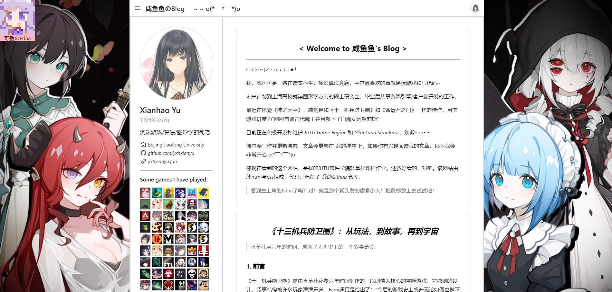
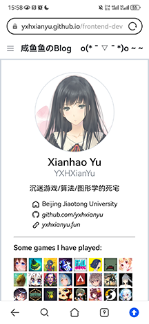
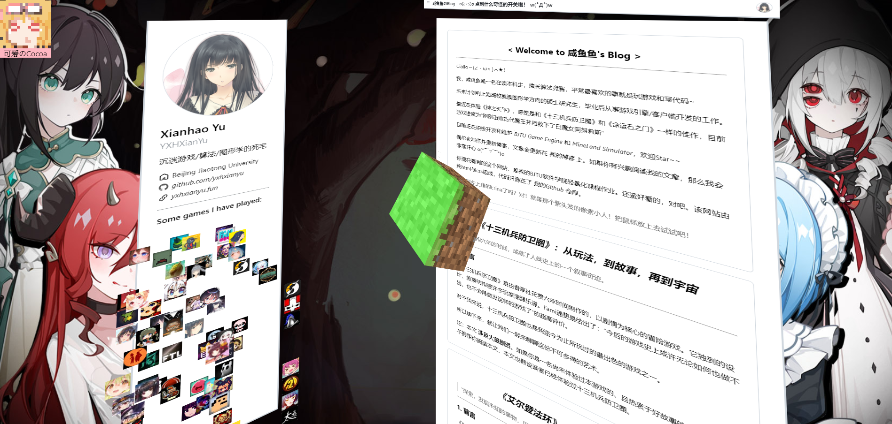

# 轻量化平台开发 第一次作业

> 21301114 俞贤皓

## 1. 简介

* 作业内容：制作一个静态的个人主页
* 本次作业内容已部署在 [Github Pages](https://yxhxianyu.github.io/frontend-development-assignments/)，并在 [同一仓库](https://github.com/YXHXianYu/frontend-development-assignments) 开源
  * 可以通过链接直接进入主页，查看效果
* 我完成了本次作业的 **所有** 要求及加分项
* 主页预览
  * PC端
    * 
  * 移动端
    * 

## 2. 作业内容

### 2.1 基本要求

- 【完成】页面具有header sidebar content footer等基本结构
- 【完成】content的内不同形式至少5种（文本，标题，图片，列表，表格）
  - 在网页的最下方（博客文章的最后一条）集中展示了这五种不同形式内容
  - 相关内容位于 `index.html` 的254-294行，位于 `public/css/main.css` 的762-808行
- 【完成】使用flex布局,使用至少5个提到的flex属性
  - 我在整个网页中多次使用了flex布局
  - 我在 `public/css/main.css` 的第763行，将 `.assignment` 组件设置为flex布局，并调整了对应的4种flex属性，在第805行，调整了一个子组件的2种flex属性（order和align-self）
- 【完成】使用到至少两种position
  - 我在 `public/css/main.css` 的第24行使用了 `position: relative`，在第31行使用了 `position: absolute`，在第479行使用了 `position: fixed`
- 【完成】页面中要有一个悬浮组件，里面包含文本和图片
  - 页面中的 `.trigger` 组件是一个悬浮组件，持续悬浮在网页左上角。该组件包含图片和文本
  - **注意，在移动端布局下，我隐藏了该组件**
- 【完成】响应pc和mobile，两种页面有不同布局
  - 页面有3种布局，分别在以下页面宽度时触发：
    - [769, +∞)：PC端布局
    - [571, 768]：平板竖屏布局
    - [0, 570]：手机布局
- 【完成】使用2种伪类
  - 我在 `public/css/main.css` 的第24行使用了 `:hover` 伪类，在第146行使用了 `:nth-child()`
- 【完成】使用2种伪元素
  - 我在 `public/css/main.css` 的第625行使用了 `::before` 伪元素，在第29行使用了 `::after` 伪元素

### 2.2 加分项

* 编码习惯优雅
  * 应该还算编码习惯优雅吧，css按不同内容进行了归类，html文件也按照不同部分进行了归类，有一点注释
  * class和许多语义化标签的功能出现了重复，而语义化标签又不能涵盖所有可能的情况，所以class和语义化标签很容易产生混用，导致代码不优雅。所以在本次作业中我进行统一，统一使用div标签加上class的方法进行归类，而不使用语义化标签。如果爬虫或者浏览器不能正确读取，那么是其配置的问题（逃）
* 【完成】使用css动画加分
  * 我在网页的header中加入了颜文字动画
  * 同时，如果在PC布局下，将鼠标放到左上角的像素小人图标上，那么你可以看到一个酷炫的3D动画
* 【完成】使用css transform加分
  * 同上，我使用css动画和transform设计了一个3D动画
  * 
* 可以在网上寻找灵感，但不可copy抄袭
  * 本网页参考了如下网站：
    * [Github个人主页](http://github.com/YXHXianYu/)
      * 我参考了Github个人主页的Sidebar风格
      * 我复制了Github的字体（font-family）
    * [我的个人博客](https://yxhxianyu.fun/)
      * 我参考了 [Hexo](https://hexo.io/zh-cn/) 和 [NexT.Gemini主题](https://theme-next.org/) 的页面布局
    * [Steam个人主页](https://steamcommunity.com/id/yxh_xianyu/)
      * 我参考了Steam个人主页的背景壁纸
  * 3D正方体旋转的效果，我直接复制了课上的实例代码，但我做出了如下改进：
    * 将Minecraft草方块的纹理通过css应用在了正方体上
    * 通过一个wrapper，实现了草方块移动的动画效果
  * 网站的博客内容均由我自己创作