# 轻量化平台开发 第二次作业

> 21301114 俞贤皓

## 1. 简介

* 作业内容：制作一个飞机大战游戏
* 本次作业内容开源在 [我的Github](https://github.com/YXHXianYu/frontend-development-assignments)
* 我完成了本次作业中，除了排行榜以外的 **所有** 要求及加分项
* **请注意（更新）**
  * **编译结果位于目录 `./public` 中，点击 `index.html` 即可启动**
* 预览
  * 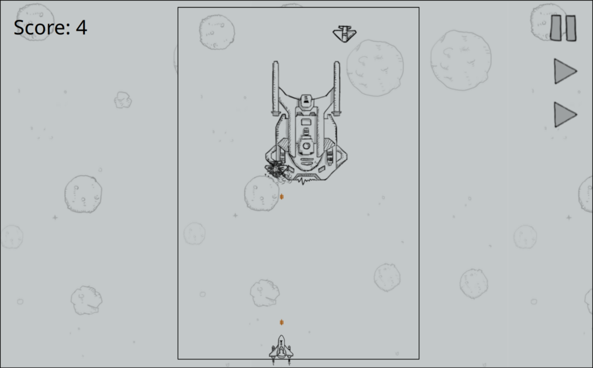

### 1.1 构建方式

- Prerequisites: node.js v18.18.2
- 构建和启动命令
  ```bash
  npm install
  npm start
  ```

## 2. 作业内容

* 预计得分 = 60 + 5 + 5 + 10 + 10 + 5 + 5 + 15 = 100 (115)

### 2.1 作业要求

- 【完成】使用响应式设计，设计一个竖屏的主页面。
  - 使用了上课说到的方法，通过 transform scale 直接缩放画板。将逻辑坐标与渲染坐标相分离。
  - 大屏幕
    - 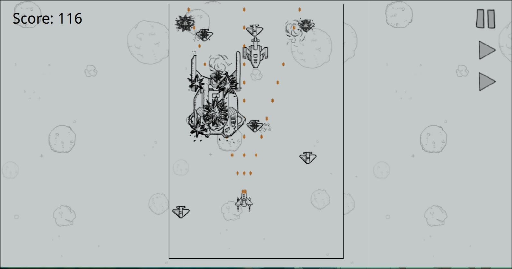
  - 小屏幕
    - 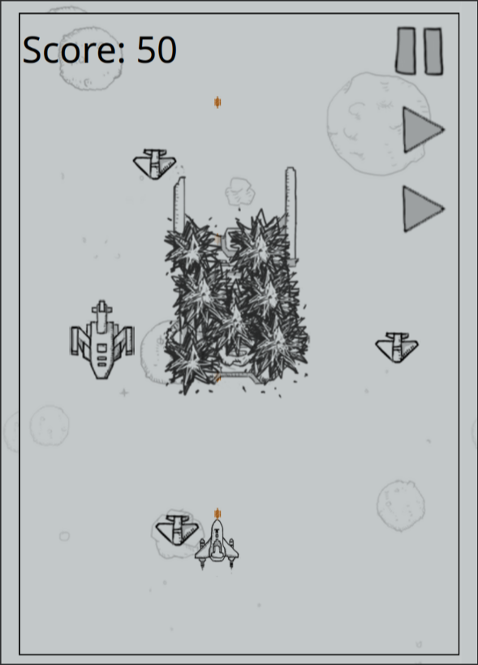
- 【完成】我方飞机使用鼠标或者键盘控制移动，自动发射子弹，敌机小飞机随机出现，子弹击落敌机后得分，我方飞机遭遇敌方飞机撞击，视为失败，统计分数。（60分）
  - 使用WASD可以控制飞机的移动
  - 均完成
  - 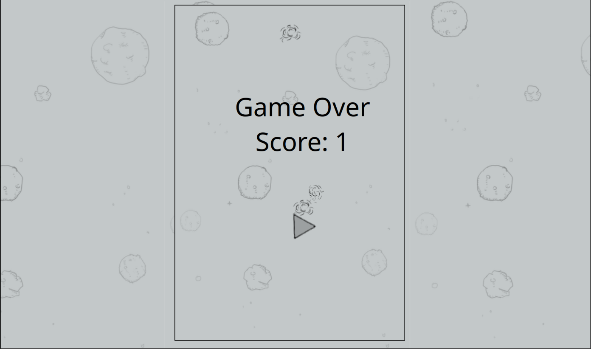
- 【完成】游戏可以暂停、继续、重新开始（5分）
  - 游戏右上角有三个按钮，分别为：暂停/继续、重新开始、播放回放
  - 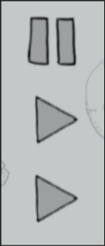
- 【完成】我方飞机和敌方飞机均有运行/中弹/损毁 动画（5分）
  - 运行
    -  
  - 中弹
    - 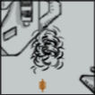
  - 损毁
    - 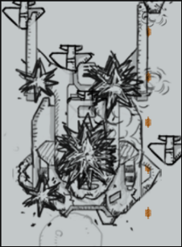
- 【完成】三种飞机，不同宽度/速度/血量/得分（10分）
  - 小飞机
    - 1发子弹，速度2，得分1分
    - Hitbox为(40, 40)
    - 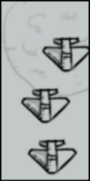
  - 中飞机
    - 3发子弹，速度1，得分3分
    - Hitbox为(50, 100)
    - 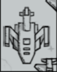
  - 大飞机
    - 20发子弹，速度0.4，得分20分
    - Hitbox为(150, 250)
    - 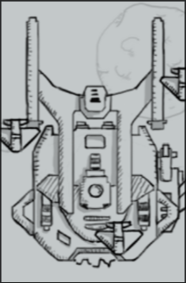
- 【完成】道具补给（10分）
  - 当玩家到达1000分以上时，游戏会提供两种道具
  - 炸弹道具，会杀死所有敌方飞机
    - 
  - 弹药道具，**可以让你射出更多发子弹！**
    - 这个道具超级酷炫的！爽到！
    - 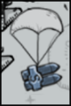
  - 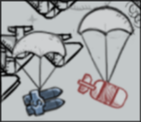
- 【完成】根据分数来逐步提高难度，难度的提高表现为飞机数量的增多以及速度的加快（5分）
  - 每到达 30, 100, 300, 500, 2000, 10000 时，敌方飞机数量增加，玩家子弹增加
  - 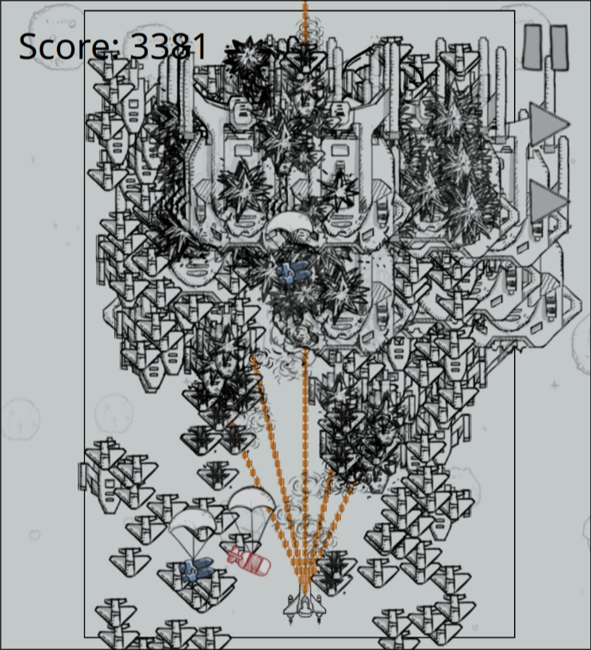
- 【完成】界面优美，动画流畅（5分）
  - 动画还是非常流畅的，操作也没有任何延迟
- 【完成】录像回放功能，将录制数据放在localstorage/websql上，以供变速回放（15分）
  - 按下右上角第三个按键，便可以启动回放功能
  - 系统会录制下一次游戏中用户的所有输入状态，点击回放后，便会重放用户状态

### 2.2 作业要求之外我自己加的功能

- 使用ECS架构
  - 面向数据编程，拥有良好的可拓展性和性能，适合游戏开发
- 输入重载
  - 对输入进行了重载，可以实现丝滑的移动（包括同时按下多个输入按键）
- Debug模式
  - 按下 o 键，可以在 Normal模式 和 Debug模式 中切换
  - Debug模式会绘制所有的Hitbox和纹理边框，便于Debug
  - 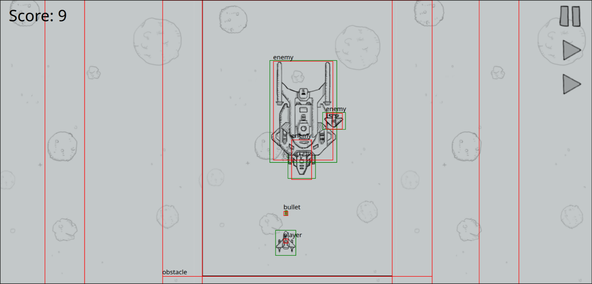
  - 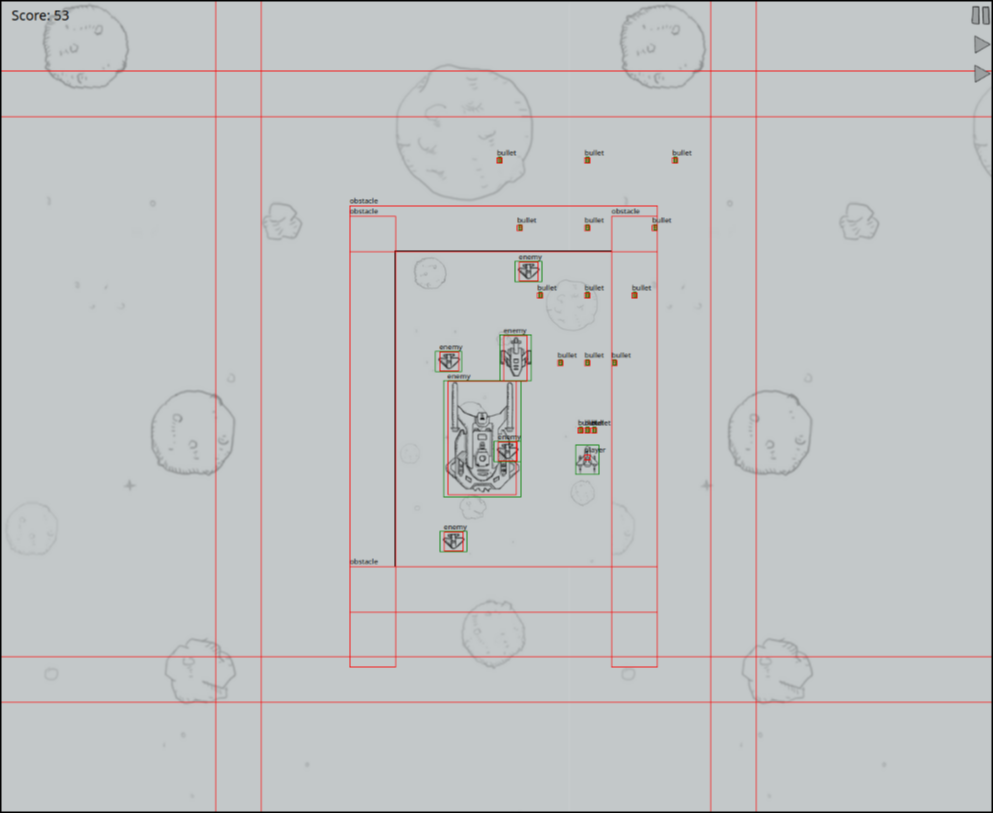
- 基于物理的逻辑处理
  - 游戏内所有逻辑判断均基于Hitbox，判断两Hitbox是否相交
  - 在Debug模式下，可以看到所有物体的Hitbox
  - 当玩家超出地图边界时，会有一个弹性Hitbox将玩家弹回地图内（手感好）
