# 轻量化第三次小作业

> 21301114 俞贤皓

## 1. 简介

* 作业内容：信息管理系统
* 本次作业内容开源在 [我的Github](https://github.com/YXHXianYu/frontend-development-assignments)
* 我完成了以下功能
  * 纯React静态页面 60分
  * 后台用户管理 10分
  * 数据持久化 10分
  * 后端联动 20分
    * 使用 node.js / express.js 实现（PPT说加分）
  * **总分 100分**（60+10+10+20）
* 注意：我参考了JS老师提供的第三次作业模板，但我对模板学习后，进行了 **大幅度** 的修改
  * 修改内容包括但不限于：
  * **代码风格**：我觉得React把所有内容塞在return里的风格非常不优雅，所以我限制 **一个组件必须在一行内** 编写完成。多余的部分应该在函数体内进行定义。
    * 例如：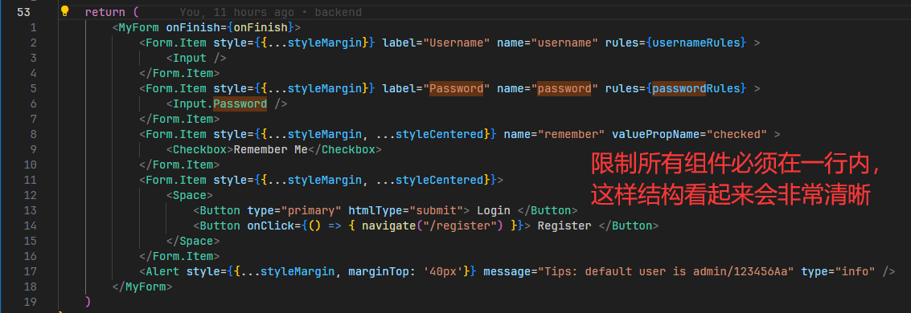
  * **后端与异步**：因为我添加了后端，所以前端需要通过axios发送请求。而发送请求就带来了异步问题，我将数据交换 **改为了异步**，并且添加了对应的States，**使得数据能够正确刷新**
  * **封装**：模板中存在一些代码，在多个地方出现，需要抽象和封装。所以我对这些代码进行了抽象和封装，例如：**MyForm**（Login和Register的表格）、**Rules**（Input输入的规则）等。
  * **UI与风格**：改变了UI风格为 **我最喜欢的像素风格**：像素字体 + 像素背景 + 扁平化UI
* 预览
  * 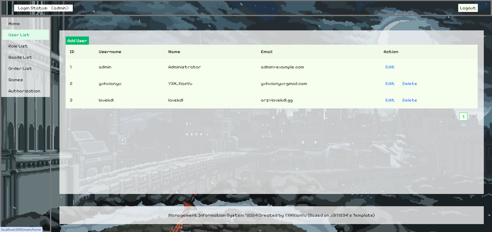

## 2. 代码说明

* 前端位于 `./frontend`

  * 构建：`npm install`

  * 运行：`npm start`

  * 根据JS老师模板修改的前端，基于 React + Ant Design

  * **预编译版本位于** `./frontend/build`

    * 在 `./frontend` 目录下执行

      ```bash
      npm install -g serve
      serve -s ./build
      ```

    * 即可启动前端

* 后端位于 `./backend`

  * 构建：`npm install`
  * 运行：`npm start` 或 `node ./index.js`
  * 使用 **express.js** 实现的一个 **极端轻量化** 的 **Redis风格** 后端
  * 后端无预编译版本（因为本身就只有单文件）

## 3. 功能说明

### 3.1 纯React静态页面（60分）

* 登录页面
  * 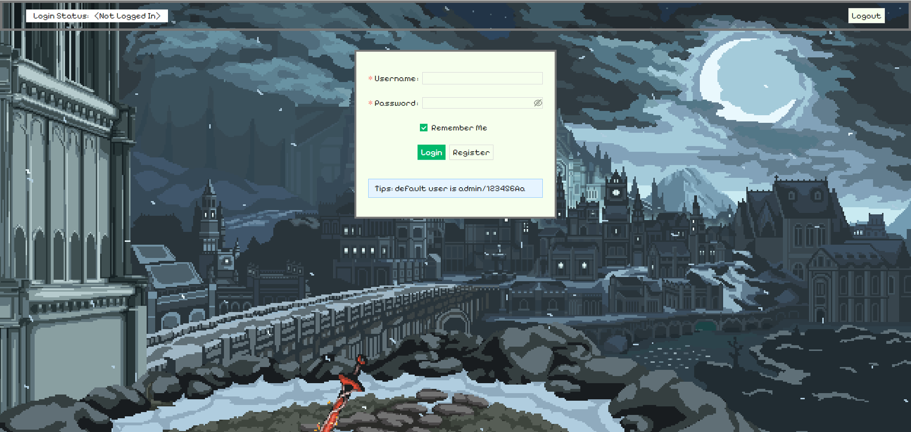
* 登陆页面（缺少输入）
  * 
* 登陆页面（密码不够长）
  * 
* 注册页面
  * 
* 注册页面（缺少输入）
  * 
* 注册页面（邮箱格式不正确）
  * 
* 注册页面（密码缺少大写字符或小写字符）
  * 
* 主页面
  * 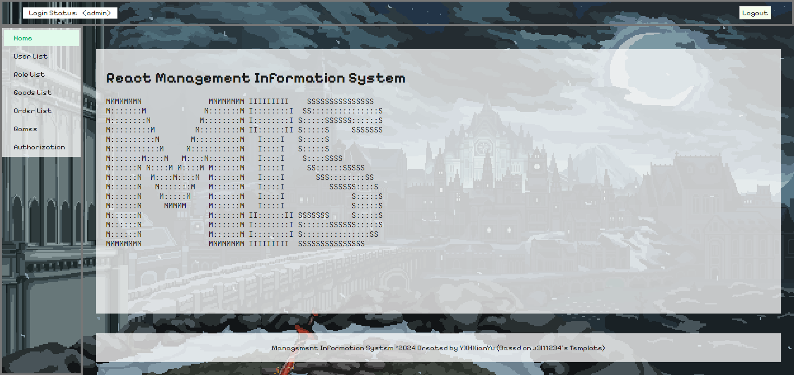
* 其他页面
  * 

* 用户管理界面
  * 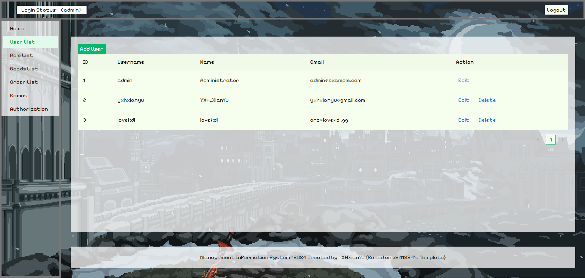

### 3.2 后台用户管理（10分）

* 修改用户（修改lovekdl用户的邮箱，修改前）
  * 
  * 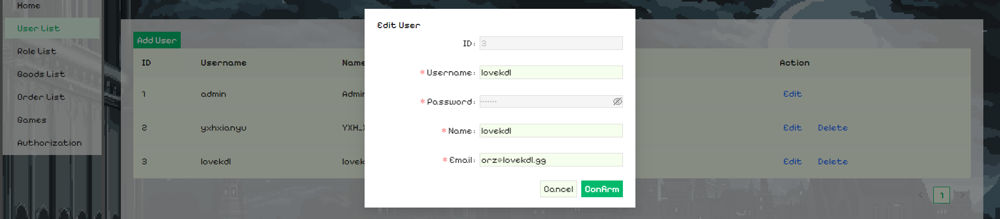
* 修改用户（修改lovekdl用户的邮箱，修改后）
  * 
* 添加用户（添加FJQ同学）
  * 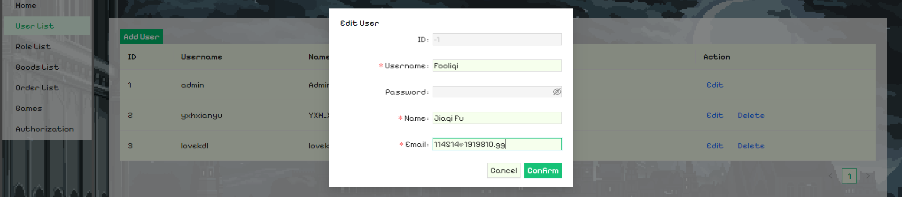
* 添加用户（结果）
  * 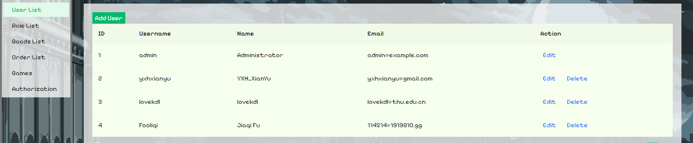
* 删除用户（删除FJQ同学）
  * 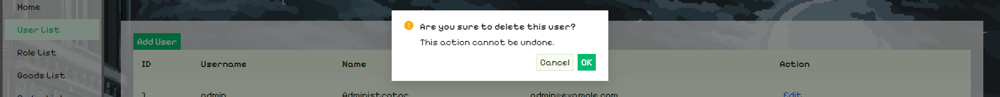
* 删除用户（结果）
  * 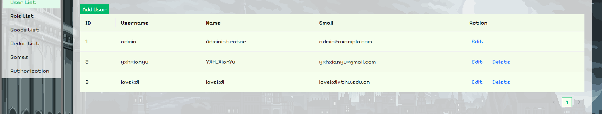
* 重启浏览器，发现数据仍保留
  * 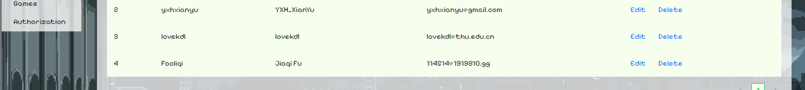

### 6.3 数据持久化（10分）

* 经检查，数据已经同步到后端数据库中
  * 删除前
    * 
  * 删除后
    * 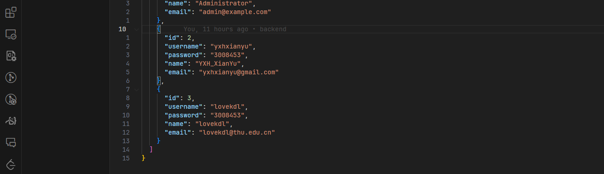

### 6.4 后端联动（20分）

* 使用express.js实现
* 后端日志
  * 
* 后端核心代码
  * 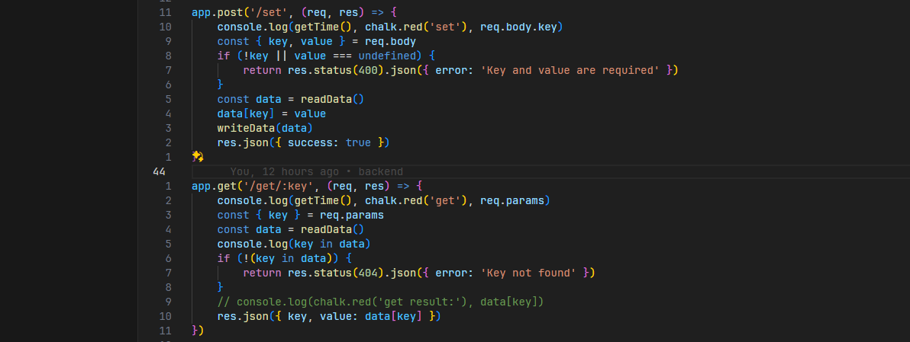
* 前端交互部分代码：
  * 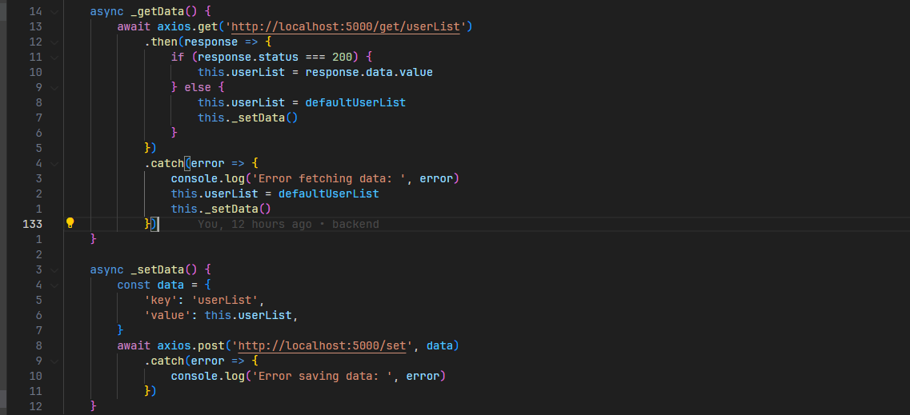
* 前端异步代码：检查用户是否登录，路由跳转
  * 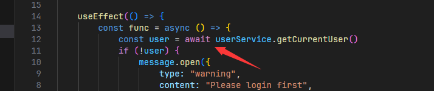
* 前端异步代码：Header的登陆状态
  * 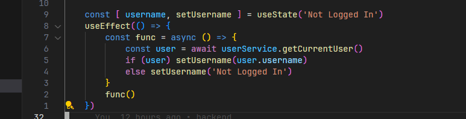
