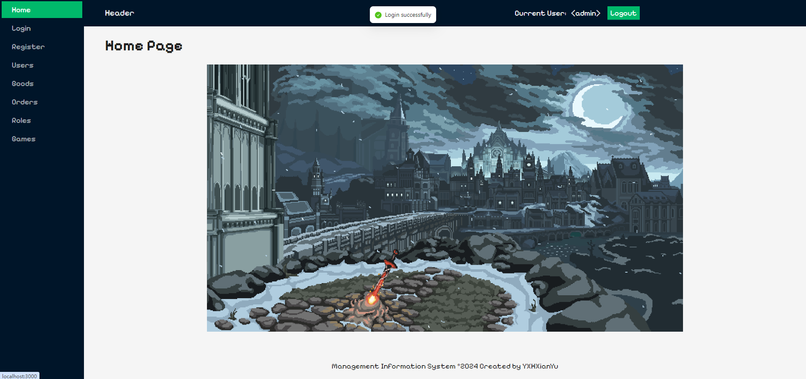

# 轻量化第三次小作业

> 21301114 俞贤皓

## 1. 简介

* 作业内容：信息管理系统
* 本次作业内容开源在 [我的Github](https://github.com/YXHXianYu/frontend-development-assignments)
* 我完成了以下功能
  * 纯React静态页面 60分
  * 后台用户管理 10分
  * 数据持久化 10分
  * 后端联动 20分
    * 使用 node.js / express.js 实现（PPT说加分）
  * **总分 100分**（60+10+10+20）
* **关于模板参考**
  * **我没有参考任何老师的模板**
  * 我在 **第一次** 完成本次作业的时候，参考了老师的模板。但在通知后，我 **完全从零开始，重新编写了本次作业**，并且 **特意以不同的架构实现本次作业**，目前和老师的模板没有任何相似之处。
  
* 预览
  * 
  * 
  * 

## 2. 代码说明

* 前端位于 `./frontend`

  * 构建：`npm install`

  * 运行：`npm start`

  * 基于 React + Ant Design

  * **预编译版本位于** `./frontend/build`

    * 在 `./frontend` 目录下执行

      ```bash
      npm install -g serve
      serve -s ./build
      ```

    * 即可启动前端

* 后端位于 `./backend`

  * 构建：`npm install`
  * 运行：`npm start` 或 `node ./index.js`
  * 使用 **express.js** 实现的一个极端轻量化的Redis风格后端
  * 后端无预编译版本（因为本身就只有单文件）

## 3. 功能说明

### 3.1 纯React静态页面（60分）

* 登录页面
  * 
* 登陆页面（缺少输入）
  * 
* 登陆页面（密码不够长）
  * 
* 注册页面
  * 
* 注册页面（缺少输入）
  * 
* 注册页面（邮箱格式不正确）
  * 
* 注册页面（密码缺少大写字符或小写字符）
  * 
* 主页面
  * 
* 其他页面
  * 

* 用户管理界面
  * 

### 3.2 后台用户管理（10分）

* 修改用户（修改lovekdl用户的邮箱，修改前）
  * 
  * 
* 修改用户（修改lovekdl用户的邮箱，修改后）
  * 
* 随机添加用户（添加到了第二页）
  * 
* 删除用户（删除前）
  * 
* 删除用户（删除后）
  * 
* 重启浏览器，数据修改仍存在
  * 

### 6.3 数据持久化（10分）

* 经检查，数据已经同步到后端数据库中
  * 
* 同时，重启浏览器或者刷新网页，都不会取消登陆状态（需要手动点击Logout退出登陆状态）
  * 


### 6.4 后端联动（20分）

* 使用express.js实现
* 后端日志
  * 
* 后端核心代码
  * 
* 前端交互部分代码：
  * 
  * 
* 前端异步代码：初始化 & 获取用户数据
  * 
* 前端异步代码：刷新Header的Current User
  * 

> < 演示结束 >

***

## 4. 关于我第一次实现的本次作业

* 因为我这周末要参加南大的夏令营，复习时间很紧。第一次实现作业时，认真写了css，但第二次实现时就没有时写css了😭。所以在这里纪念一下我第一次实现本次作业的UI和界面（笑）。
* 
* 
* 
